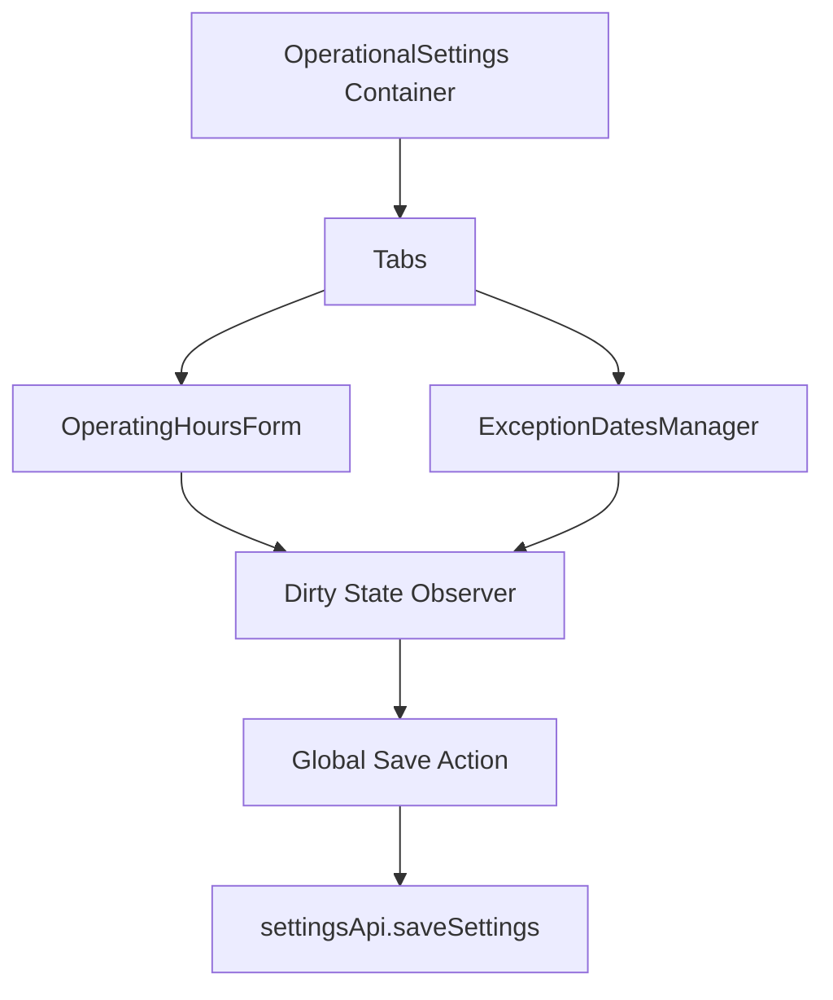

# System Design & Architecture

## Architecture Overview
**Cấu trúc hệ thống cấp cao?**

Hệ thống sử dụng mô hình Client-side State Management để theo dõi các thay đổi chưa lưu, kết hợp với các hooks của React Hook Form.

## Data Models
**Các thay đổi về model?**

Về cơ bản, cấu trúc `OperationalSettings` không thay đổi nhiều, nhưng cần mở rộng validation:
- `OperatingHour`: Hỗ trợ `close_time < open_time` (ca qua đêm).
- `ExceptionDate`: Cần hỗ trợ mảng các ngày hoặc cơ chế lưu trữ linh hoạt hơn nếu chọn Range (Tạm thời: Frontend sẽ phân rã Range thành các ngày đơn lẻ để giữ nguyên API hiện tại).

## API Design
**Giao diện lập trình?**

- `GET /api/v1/system/settings`: Lấy cấu hình hiện tại.
- `PUT /api/v1/system/settings`: Lưu toàn bộ cấu hình (Atomic update).

## Component Breakdown
**Các thành phần chính?**

- **`UnsavedChangesHandler`**: Component ẩn hoặc hook theo dõi `isDirty` của các form để hiện `Prompt` cảnh báo.
- **`RangeDatePicker`**: Nâng cấp từ single date picker để hỗ trợ chọn từ-đến.
- **`CopyHoursButton`**: Component nhỏ xuất hiện cạnh mỗi dòng Thứ, cho phép copy sang ngày khác.
- **`ConfirmationDialog`**: Reusable component cho hành động xóa.

## Design Decisions
**Tại sao chọn hướng tiếp cận này?**

1. **Phân rã Range thành ngày đơn lẻ**: Giúp Backend không phải thay đổi schema, Frontend chịu trách nhiệm tạo ra N bản ghi nếu người dùng chọn 5 ngày nghỉ.
2. **Global Save vs Tab Save**: Chuyển sang cơ chế theo dõi trạng thái thay đổi toàn cục (Global Dirty State) để người dùng có thể chỉnh sửa ở nhiều tab rồi lưu một lần. Điều này giảm số lượng request và tăng tính nhất quán.
3. **Overnight Shift Logic**: Sử dụng so sánh thời gian thông qua phút (minutes since midnight) hoặc đơn giản là cho phép `close < open` và đánh dấu record đó là "Next Day".

## Non-Functional Requirements
**Yêu cầu phi chức năng?**

- **Performance**: Việc copy giờ hoặc thêm hàng loạt ngày ngoại lệ phải phản hồi tức thì trên UI (<100ms).
- **Usability**: Các nút hành động (Lưu/Hủy) phải luôn ở vị trí dễ quan sát khi form dài.
- **Reliability**: Đảm bảo không mất dữ liệu ngay cả khi mất mạng đột ngột (tích hợp `localStorage` backup nếu cần).
