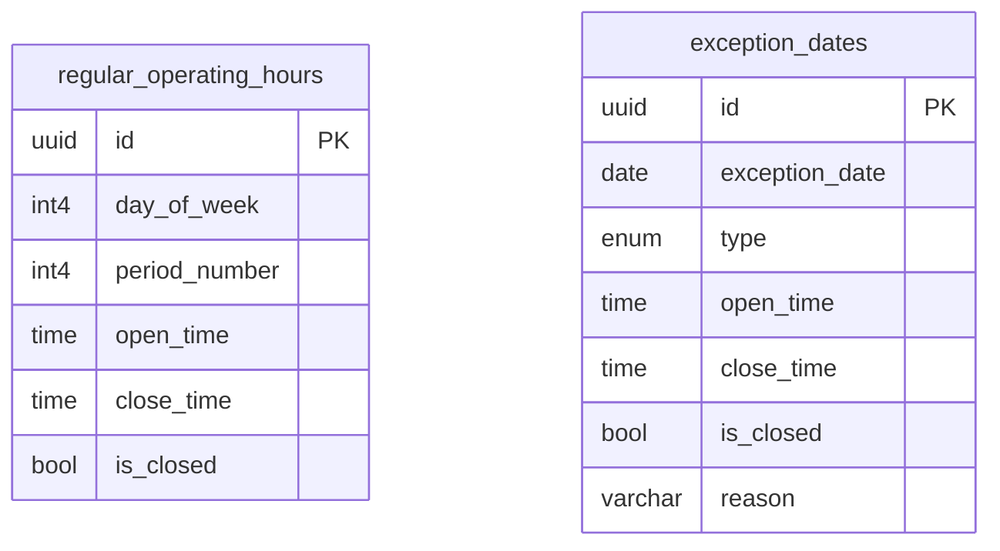

# System Design & Architecture: Operational Settings

## Architecture Overview
Hệ thống sử dụng bộ nhớ lưu trữ bền vững với 2 bảng chính. `exception_dates` có quyền ưu tiên cao nhất khi tính toán lịch khả dụng.

> [!NOTE]
> UI v1 chỉ xử lý `period_number = 1`. Backend cần sẵn sàng cho việc mở rộng đa khung giờ sau này.

### Key Components
- **`BusinessHoursForm`:** Chứa danh sách 7 ngày trong tuần, mỗi ngày có `Switch` (Open/Closed) và 2 `TimePicker` (Start/End).
- **`HolidayManager`:** Một `Calendar` bên cạnh danh sách các ngày nghỉ đã thiết lập. Cho phép tích chọn ngày và nhập mô tả.

## Data Models (Proposed)
### `BusinessHour`
- `id`: UUID (PK)
- `day_of_week`: Integer (0-6)
- `is_open`: Boolean
- `open_time`: Time (string HH:mm)
- `close_time`: Time (string HH:mm)

### `Holiday`
- `id`: UUID (PK)
- `date`: Date (ISO)
- `description`: String
- `is_recurring`: Boolean (Hàng năm or 1 lần)

## UI Design Concepts
- **Grid Layout:** Sử dụng Card cho từng ngày trong tuần để người dùng dễ nhìn thấy khung thời gian.
- **Micro-interactions:** Tự động vô hiệu hóa (disable) các ô nhập giờ nếu ngày được đánh dấu là "Đóng cửa".
- **Validation:** Hiển thị lỗi ngay lập tức nếu `open_time` >= `close_time`.

## Design Decisions
- **Lưu trữ tập trung:** Nút "Lưu thay đổi" sẽ thu thập toàn bộ State của Form và gửi 1 request duy nhất (Batch Update) tới Backend.
- **Override Logic:** Ngày trong `exception_dates` sẽ ghi đè hoàn toàn cấu hình tại `regular_operating_hours` cho ngày đó.

## Non-Functional Requirements
- **Liveness:** Các thiết lập phải được cache phía FE nhưng đảm bảo đồng bộ mới nhất khi Manager truy cập trang cài đặt.
- **Accessibility:** Các target click tối thiểu đạt 44x44px đối với các Switch và Input trên Tablet.
