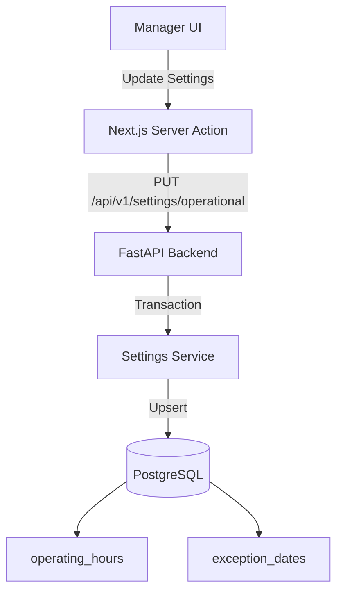

# Operational Settings System Design

## Architecture Overview
**High-Level Structure**
- **Frontend**: Next.js App Router -> Server Actions -> Backend API.
- **Backend**: FastAPI Router (`/modules/settings`) -> SQLModel Service -> PostgreSQL.
- **Database**: Two tables: `operating_hours` and `exception_dates`.



## Data Models

### 1. OperatingHour
Scores regular weekly schedule.

```sql
TABLE operating_hours (
    day_of_week INTEGER PRIMARY KEY, -- 0=Sunday, 1=Monday, ..., 6=Saturday
    open_time TIME NOT NULL,
    close_time TIME NOT NULL,
    is_closed BOOLEAN DEFAULT FALSE
);
```

### 2. ExceptionDate
Stores specific dates with overrides.

```sql
TABLE exception_dates (
    id UUID PRIMARY KEY DEFAULT gen_random_uuid(),
    date DATE UNIQUE NOT NULL,
    reason TEXT,
    is_closed BOOLEAN DEFAULT FALSE,
    open_time TIME,
    close_time TIME
);
```

## API Design

### Base URL: `/api/v1/settings/operational`

#### 1. GET `/`
- **Description**: Retrieve current settings.
- **Response**:
  ```json
  {
    "regular_operating_hours": [
      { "day_of_week": 1, "open_time": "08:00", "close_time": "20:00", "is_closed": false },
      ...
    ],
    "exception_dates": [
      { "date": "2024-02-10", "is_closed": true, "reason": "Tet Holiday" }
    ]
  }
  ```

#### 2. PUT `/`
- **Description**: Replace all settings (full update).
- **Body**: Same structure as Response.
- **Logic**:
  - Run in Transaction.
  - Delete old data in `operating_hours` and `exception_dates` (or smart merge).
  - Insert new data.
- **Security**: `require_manager` role.

## Component Breakdown
- **Frontend**:
  - `OperatingHoursForm`: UI for Mon-Sun editing.
  - `ExceptionDatesManager`: UI for adding/removing dates.
  - `actions.ts`: Fetch/Save logic connecting to FastAPI.
- **Backend**:
  - `app/modules/settings/models.py`: SQLModel classes.
  - `app/modules/settings/schemas.py`: Pydantic schemas.
  - `app/modules/settings/service.py`: CRUD logic.
  - `app/modules/settings/router.py`: Endpoints.

## Design Decisions
- **Transactional Update**: We use `PUT` to replace the whole configuration state to ensure consistency. It simplifies the specific "edit one day" logic on the frontend by sending the whole valid state.
- **SQLModel Tables**: Separating `operating_hours` and `exception_dates` allows easy querying for "is today a holiday?" (lookup in `exception_dates` first, fall back to `operating_hours`).

## Non-Functional Requirements
- **Performance**: Settings are read frequently (every booking check) but written rarely. Queries must be efficiently indexed (Primary Keys are sufficient).
- **Consistency**: Updates must be atomic.
