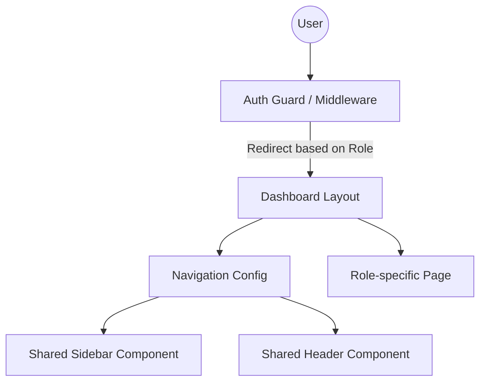

# System Design & Architecture: Role-Based Layouts

## Architecture Overview (Updated)
Dựa trên phân tích về độ phức tạp của Parallel Routes, hệ thống sẽ chuyển hướng sang sử dụng **Route Groups kết hợp với Shared Navigation Config** và **Nested Layouts**. Cách tiếp cận này giúp giảm thiểu lỗi hydration, dễ bảo trì và đảm bảo tính DRY cao hơn.

### Cấu trúc Routing
- **URL Unified (`/dashboard`):** Sử dụng một trang điều phối (Dispatcher) hoặc chuyển hướng (Redirect) dựa trên Role từ Server Component.
- **Thư mục tổ chức:**
    - `src/app/(dashboard)/(manager)/`
    - `src/app/(dashboard)/(receptionist)/`
    - `src/app/(dashboard)/(technician)/`
    - `src/app/(dashboard)/(customer)/`

## Component Strategy (DRY & Performance)
### 1. Unified Components
- **`AppSidebar`:** Một component duy nhất nhận `role` làm props và tự động render menu từ `navigationConfig`.
- **`NavigationConfig`:** File tập trung định nghĩa menu, icons, và permissions cho từng vai trò.
- **`RoleGuard`:** Server-side component bao bọc các trang nhạy cảm để kiểm tra quyền truy cập.

### 2. Middleware & Auth
- **Lightweight Middleware:** Middleware chỉ thực hiện xác thực Token (JWT) và kiểm tra sự tồn tại của Role claim.
- **Server Actions/Components:** Logic lấy thông tin chi tiết người dùng và kiểm tra RBAC sâu hơn được thực hiện tại Server Components để tránh tăng latency cho middleware.

## Design Decisions
- **Tại sao bỏ Parallel Routes?**
    - Tránh việc phải quản lý quá nhiều file `default.tsx`.
    - Giảm rủi ro lỗi "lost slot" khi điều hướng client-side phức tạp.
    - Dễ dàng Debug và Unit Test hơn cho từng trang của Role.
- **Tại sao dùng Shared Config?**
    - Đảm bảo tính nhất quán của UI (Headers, Spacing) giữa các role.
    - Dễ dàng cập nhật menu cho tất cả các role tại một nơi duy nhất.

## Non-Functional Requirements
- **Performance:** Thời gian render sidebar và menu không vượt quá 100ms sau khi có dữ liệu role.
- **Security:** Chặn truy cập layout bằng middleware kết hợp với logic check role tại server-side layout.
