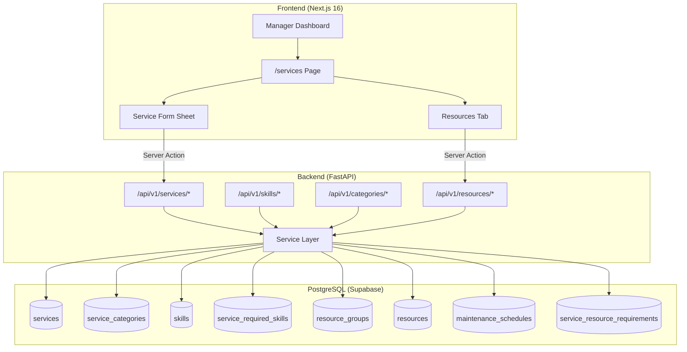
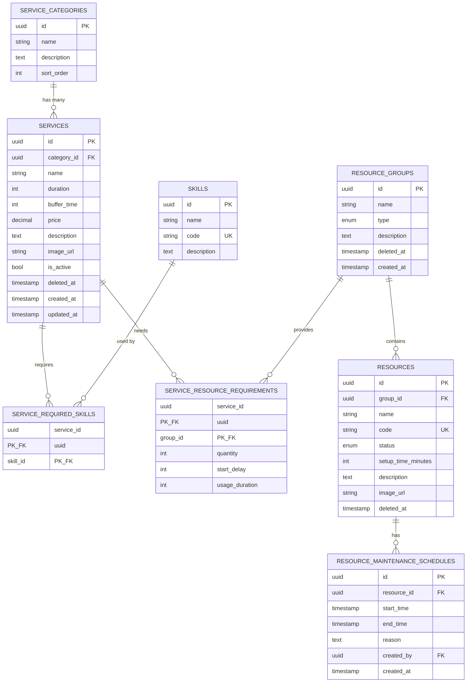

# Service & Resource Management - System Design

## Architecture Overview

### High-Level System Structure



### Technology Stack

| Layer | Technology | Rationale |
|-------|------------|-----------|
| Frontend | Next.js 16 + React 19 | App Router, Server Components, Server Actions |
| UI Components | Shadcn/UI + Tailwind 4 | Consistent design system, accessible |
| State Management | React Hook Form + Zod | Form handling with validation |
| Backend | FastAPI + SQLModel | Async, Pydantic v2, auto-docs |
| Database | PostgreSQL (Supabase) | Managed, RLS-ready, Realtime (future) |
| ORM | SQLModel | Type-safe, async support |

---

## Data Models

### Entity Relationship Diagram



### Enums

| Enum | Values | Usage |
|------|--------|-------|
| `ResourceType` | `BED`, `EQUIPMENT` | Phân loại nhóm tài nguyên |
| `ResourceStatus` | `ACTIVE`, `MAINTENANCE`, `INACTIVE` | Trạng thái từng tài nguyên |

---

## API Design

### Base URL & Auth

- **Base**: `/api/v1`
- **Auth**: JWT Bearer token required
- **RBAC**: `MANAGER` = Full CRUD, `RECEPTIONIST` = Read only

### Endpoints Summary

#### Skills (`/skills`)

| Method | Endpoint | Description |
|--------|----------|-------------|
| GET | `/skills` | List all skills |
| GET | `/skills/{id}` | Get skill detail |
| POST | `/skills` | Create skill (name, code, description) |
| PUT | `/skills/{id}` | Update skill (name, description only) |
| DELETE | `/skills/{id}` | Delete skill (validate no references) |

#### Categories (`/categories`)

| Method | Endpoint | Description |
|--------|----------|-------------|
| GET | `/categories` | List categories (sorted by sort_order) |
| POST | `/categories` | Create category |
| PUT | `/categories/{id}` | Update category |
| PUT | `/categories/reorder` | Reorder categories (body: `{ids: UUID[]}`) |
| DELETE | `/categories/{id}` | Delete category (validate no services) |

#### Resource Groups (`/resource-groups`)

| Method | Endpoint | Description |
|--------|----------|-------------|
| GET | `/resource-groups` | List all groups with resource count |
| POST | `/resource-groups` | Create group (name, type, description) |
| PUT | `/resource-groups/{id}` | Update group |
| DELETE | `/resource-groups/{id}` | Soft delete (validate no references) |

#### Resources (`/resources`)

| Method | Endpoint | Description |
|--------|----------|-------------|
| GET | `/resources` | List resources (filter: group_id, status) |
| GET | `/resources/{id}` | Get resource detail + schedules |
| POST | `/resources` | Create resource |
| PUT | `/resources/{id}` | Update resource |
| DELETE | `/resources/{id}` | Soft delete |
| POST | `/resources/{id}/maintenance` | Schedule maintenance |
| DELETE | `/resources/{id}/maintenance/{mid}` | End maintenance early |

#### Services (`/services`)

| Method | Endpoint | Description |
|--------|----------|-------------|
| GET | `/services` | List services (filter: category, status, search) |
| GET | `/services/{id}` | Get service detail (includes skills, resources) |
| POST | `/services` | Create service (full payload with skills, resources) |
| PUT | `/services/{id}` | Update service |
| PATCH | `/services/{id}/status` | Toggle is_active |
| DELETE | `/services/{id}` | Soft delete |

### Key Request/Response Shapes

**ServiceCreate**:
- `name`, `category_id?`, `duration`, `buffer_time`, `price`, `description?`, `image_url?`
- `skill_ids: UUID[]`
- `resource_requirements: [{group_id, quantity, start_delay, usage_duration}]`

**ServiceDetail**:
- All service fields
- `category: {id, name}`
- `skills: [{id, name, code}]`
- `resource_requirements: [{group: {id, name, type}, quantity, start_delay, usage_duration}]`

---

## Component Breakdown

### Frontend Structure (FSD)

```
frontend/src/
├── app/(dashboard)/(manager)/dashboard/manager/services/
│   ├── page.tsx              # Main page with Tabs
│   └── loading.tsx           # Skeleton
│
└── features/services/
    ├── actions.ts            # Server Actions
    ├── types.ts              # TypeScript interfaces
    ├── schemas.ts            # Zod schemas
    │
    └── components/
        ├── service-management.tsx
        ├── service-management-skeleton.tsx
        │
        ├── services-tab/
        │   ├── services-table.tsx
        │   ├── service-form-sheet.tsx
        │   └── service-filters.tsx
        │
        ├── categories-tab/
        │   ├── categories-list.tsx (sortable)
        │   └── category-form-dialog.tsx
        │
        ├── skills-tab/
        │   ├── skills-table.tsx
        │   └── skill-form-dialog.tsx
        │
        └── resources-tab/
            ├── resources-grouped-list.tsx
            ├── resource-form-dialog.tsx
            ├── resource-group-form-dialog.tsx
            └── maintenance-dialog.tsx
```

### Backend Structure (3-Layer)

```
backend/app/modules/
├── services/
│   ├── models.py       # Service, ServiceRequiredSkill, ServiceResourceRequirement
│   ├── schemas.py      # Pydantic DTOs
│   ├── router.py       # FastAPI endpoints
│   └── service.py      # Business logic
│
├── skills/
│   ├── models.py       # Skill
│   ├── schemas.py
│   ├── router.py
│   └── service.py
│
├── categories/
│   ├── models.py       # ServiceCategory
│   ├── schemas.py
│   ├── router.py
│   └── service.py
│
└── resources/
    ├── models.py       # ResourceGroup, Resource, MaintenanceSchedule
    ├── schemas.py
    ├── router.py
    └── service.py
```

---

## Design Decisions

### 1. Dịch vụ link đến Resource Group, không phải Resource cụ thể

**Decision**: `service_resource_requirements.group_id` thay vì `resource_id`.

**Rationale**: Khi booking, Scheduling Engine sẽ tự tìm resource trống trong group. Không cần hardcode resource cụ thể vào dịch vụ.

### 2. start_delay và usage_duration là Optional

**Decision**: Default = 0 và NULL (dùng cả buổi).

**Rationale**: 90% dịch vụ đơn giản không cần config phức tạp. Chỉ 10% dịch vụ đặc biệt (HydraFacial) mới cần.

### 3. Soft Delete cho entities chính

**Decision**: Services, Resources, Resource Groups có `deleted_at`.

**Rationale**: Giữ referential integrity với booking history.

### 4. Skill code immutable

**Decision**: Không cho sửa `code` sau khi tạo.

**Rationale**: Scheduling Engine dựa vào code để match. Thay đổi code có thể break references.

### 5. forceMount cho Tabs

**Decision**: Tất cả tabs render sẵn, ẩn bằng CSS.

**Rationale**: Instant switching, no loading delay. Trade-off acceptable cho admin pages.

### 6. Tách 4 API modules riêng biệt

**Decision**: `/skills`, `/categories`, `/resources`, `/services` là các routers riêng.

**Rationale**: Single Responsibility. Dễ maintain, test, và mở rộng độc lập.

---

## Non-Functional Requirements

### Performance

| Metric | Target |
|--------|--------|
| List load (100 items) | < 500ms |
| Create/Update | < 300ms |
| Tab switching | Instant (CSS) |

### Security

- JWT authentication required
- Role-based access control (MANAGER vs RECEPTIONIST)
- Input validation: Zod (FE) + Pydantic (BE)
- Parameterized queries (SQLModel)

### Data Integrity

- Foreign key constraints
- Unique constraints (skill.code, resource.code)
- Soft delete instead of hard delete
- Cascade validation before delete

### Scalability

- Pagination for large lists (> 50 items)
- Server-side filtering
- Cache invalidation via `revalidatePath`
