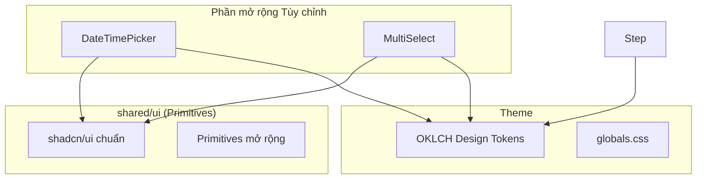

# Thiết kế Hệ thống & Kiến trúc

## Tổng quan Kiến trúc
**Cấu trúc hệ thống cấp cao là gì?**

Thư viện UI tuân theo triết lý **Atomic Design** trong lớp "shared" của **Feature-Sliced Design (FSD)**.

## Mô hình Dữ liệu
**Chúng ta cần quản lý dữ liệu gì?**

- **Component Props**: Interface TypeScript chuẩn hóa cho tất cả UI component.
- **Form State**: Tích hợp với `react-hook-form` và `zod` cho các input component.
- **Navigation state**: Trạng thái Sidebar (thu gọn/mở rộng) sử dụng local storage/cookies.

## Phân tách Component
**Các khối xây dựng chính là gì?**

### 1. Bổ sung Nền tảng (shadcn chuẩn)
| Component | Mục đích | Dependency chính |
|-----------|----------|-----------------|
| `Sidebar` | Layout dashboard chính | `@radix-ui/react-slot` |
| `Calendar` | Chọn ngày | `react-day-picker` |
| `Popover` | Container dropdown | `@radix-ui/react-popover` |
| `Command` | Combobox/Search | `cmdk` |
| `Chart` | Trực quan hóa dữ liệu | `recharts` |

### 2. Tinh chỉnh Component Nguyên bản (Refinements)
| Component | Điều chỉnh kỹ thuật | Mục tiêu UX |
|-----------|--------------------|-------------|
| **Button** | Thêm `cursor-pointer` vào `base` hoặc global CSS | Phản hồi clickable tự nhiên trên web |
| **Sonner** | Tùy biến `toastOptions`, icon màu sắc theo OKLCH | Thông báo sinh động, khớp theme Spa |
| **Input** | Điều chỉnh `focus-visible` ring và độ dày border | Tăng tính chuyên nghiệp và rõ ràng |
| **Dialog** | Làm mờ overlay (`backdrop-blur-sm`) sâu hơn | Tập trung sự chú ý vào nội dung |

### 3. Phần mở rộng Tùy chỉnh cho Spa
| Component | Mô tả | Cách tiếp cận |
|-----------|-------|---------------|
| **DateTimePicker** | Kết hợp `Calendar` (Popover) với lưới chọn giờ nhanh | Cung cấp trải nghiệm đặt lịch "không-bước" |
| **MultiSelectCombobox** | Input `Command` với danh sách `Badge` tối giản | Chọn nhân viên/dịch vụ nhanh chóng |
| **DataTableFacetedFilter** | Component chuẩn cho lọc cột | Tiết kiệm diện tích màn hình khi tìm kiếm |

## Quyết định Thiết kế
**Tại sao chọn cách tiếp cận này?**

1. **OKLCH Colors**: Sử dụng `oklch()` cho theme "Tranquil Lotus" để có màu sắc spa thư giãn.
2. **Global Pointer Fix**: Áp dụng `cursor: pointer` toàn cục cho button để giảm code thừa.
3. **Single-page Workflows**: Ưu tiên hiển thị mọi thông tin trên một form duy nhất (hoặc Sheet) thay vì chia nhỏ thành các bước (Stepper) nhằm giảm thao tác kích chuột.
4. **Tailwind v4 (@theme)**: Sử dụng cấu trúc theme mới để dễ bảo trì.

## Yêu cầu Phi chức năng
**Hệ thống nên hoạt động như thế nào?**

- **Accessibility**: Tất cả component phải đạt chuẩn WCAG AA.
- **Performance**: Không ảnh hưởng bundle size cho component không sử dụng (tree-shaking).
- **Bundle Size**: Ưu tiên thư viện nhẹ (ví dụ: `date-fns` thay vì `moment`).
