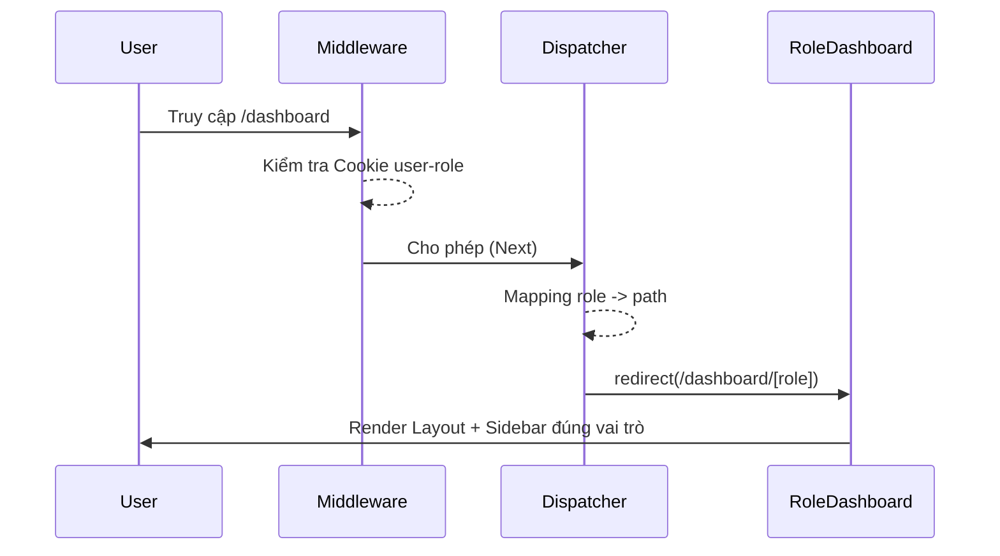

# Knowledge Capture: Dashboard Dispatcher & Role-Based Routing

## Overview
Hệ thống điều phối và phân quyền Dashboard của Synapse_KL sử dụng cơ chế **Server-side Dispatcher** kết hợp với **Next.js Middleware**. Kiến trúc này đảm bảo tính bảo mật, tránh flash nội dung (FOUC) và tuân thủ nghiêm ngặt mô hình Route Groups của Next.js App Router.

- **Ngôn ngữ:** TypeScript
- **Framework:** Next.js 16 (App Router)
- **Mục tiêu chính:** Điều hướng người dùng về đúng giao diện dựa trên vai trò (Manager, Receptionist, Technician, Customer).

## Implementation Details

### 1. Unified Dispatcher (`/dashboard/page.tsx`)
Thay vì sử dụng logic phức tạp tại Layout, trang `/dashboard` đóng vai trò là một "ngã tư".
- **Pattern:** Sử dụng `roleRoutes` Record mapping thay cho `switch-case` để đảm bảo Type-safety.
- **Behavior:** Thực hiện `redirect()` ngay tại Server Component.

### 2. Middleware Protection (`middleware.ts`)
Lớp bảo vệ vòng ngoài ngăn chặn việc người dùng thay đổi URL thủ công để truy cập trái phép.
- **Logic:** So sánh `user-role` từ Cookie với sub-path của URL.
- **Phạm vi:** Chỉ áp dụng cho matcher `/dashboard/:path*`.

### 3. Centralized Navigation (`shared/config/navigation.ts`)
Toàn bộ menu được định nghĩa tập trung.
- **DRY:** Thay đổi menu một nơi, cập nhật cho toàn bộ Sidebar của role đó.
- **Icons:** Sử dụng Lucide-react làm chuẩn icon hệ thống.

## Execution Flow (Mermaid)

## Key Patterns & Constraints
- **Route Groups:** Sử dụng `(dashboard)`, `(manager)`,... để tổ chức folder mà không làm thay đổi URL.
- **Server Components:** Mọi logic điều hướng được thực hiện ở Server để bảo mật.
- **A11y:** Sidebar tuân thủ chuẩn WCAG với các thẻ `aria-` và `sr-only` từ Radix UI.

## Metadata
- **Ngày phân tích:** 29/12/2025
- **Trạng thái:** Hoàn thành (Sử dụng Mock Role)
- **Độ sâu:** Cấu trúc File & Logic điều phối

## Next Steps
- [ ] Thay thế Mock Cookie bằng thực tế từ Auth Provider (Clerk/Auth.js hoặc Custom JWT).
- [ ] Bổ sung Unit Test cho Middleware để kiểm tra các trường hợp truy cập trái phép.
- [ ] Triển khai Role Switching (nếu cần thiết cho tài khoản Admin).
