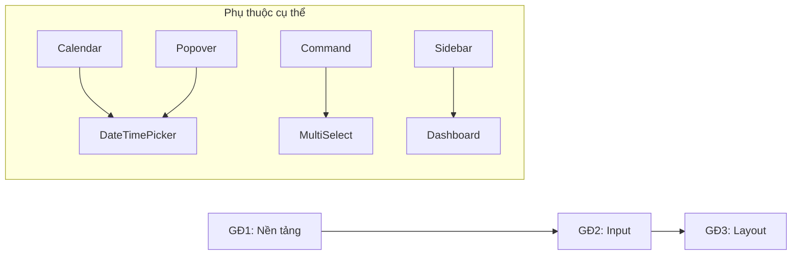

# Kế hoạch Dự án & Phân rã Công việc

## Các Mốc chính
**Các checkpoint quan trọng là gì?**

- [ ] Mốc 0: Kiểm toán & Tinh chỉnh Component Hiện có (Button, Sonner, v.v.)
- [ ] Mốc 1: Primitive Nền tảng & Tinh chỉnh UX (Button, Sidebar, Sonner)
- [ ] Mốc 2: Input Chọn nhanh (DateTimePicker, MultiSelect)
- [ ] Mốc 3: Hoàn thiện Bảng dữ liệu & Charts cơ bản

## Phân rã Công việc
**Cần làm những công việc cụ thể nào?**

### Giai đoạn 0: Kiểm toán & Tinh chỉnh (Refinement)
| Task | Mô tả | Ước tính |
|------|-------|----------|
| 0.1 | Sửa lỗi `cursor-pointer` cho Button toàn cục | 15m |
| 0.2 | Cấu hình lại `Sonner` (vị trí, duration, theme OKLCH) | 30m |
| 0.3 | Rà soát 16 component hiện có để tối ưu padding/border | 1h |

### Giai đoạn 1: Nền tảng (shadcn chuẩn)
| Task | Mô tả | Ước tính |
|------|-------|----------|
| 1.1 | Cài đặt component shadcn còn thiếu: `calendar`, `popover`, `command`, `checkbox`, `switch`, `scroll-area`, `separator`, `breadcrumb`, `sidebar`, `chart` | 1h |
| 1.2 | Xác minh và điều chỉnh token cho tất cả component mới để khớp với theme "Tranquil Lotus" | 30m |
| 1.3 | Kiểm tra `shared/ui` để đảm bảo export nhất quán trong `index.ts` | 15m |

### Giai đoạn 2: Component Chọn nhanh
| Task | Mô tả | Ước tính |
|------|-------|----------|
| 2.1 | Triển khai `DateTimePicker` tối giản cho đặt lịch Screen-one | 2h |
| 2.2 | Triển khai `MultiSelectCombobox` cho chọn nhân viên | 1.5h |

### Giai đoạn 3: Phân tích & Quản lý
| Task | Mô tả | Ước tính |
|------|-------|----------|
| 3.1 | `DataTableFacetedFilter` cho danh sách khách hàng/dịch vụ | 1h |
| 3.2 | `ChartComponents` cơ bản (Doanh thu, Lịch hẹn) | 1.5h |

## Phụ thuộc
**Điều gì cần xảy ra theo thứ tự nào?**

1. **Nền tảng** phải tồn tại trước **Phần mở rộng Input** (ví dụ: `DateTimePicker` phụ thuộc vào `Calendar` và `Popover`).
2. **Phần mở rộng Input** nên sẵn sàng trước khi xây dựng các form thực tế trong lớp "Features".

## Timeline & Ước tính
**Khi nào mọi thứ sẽ hoàn thành?**

| Giai đoạn | Thời gian ước tính | Ghi chú |
|-----------|-------------------|---------|
| Giai đoạn 1 | 1-2 giờ | Hoàn tất cài đặt và chỉnh sửa global CSS |
| Giai đoạn 2 | 3-4 giờ | Chế tạo component chọn ngày giờ nhanh |
| Giai đoạn 3 | 2-3 giờ | Thiết lập bảng dữ liệu và biểu đồ cơ bản |
| **Tổng** | **6-9 giờ** | Tối ưu hóa cho tốc độ bàn giao MVP |

## Rủi ro & Giảm thiểu
**Điều gì có thể xảy ra sai?**

| Rủi ro | Mức độ | Giảm thiểu |
|--------|--------|------------|
| Vấn đề tương thích Tailwind v4 với component shadcn cũ | Trung bình | Chạy build check sau mỗi lần thêm component |
| `DateTimePicker` phức tạp về timezone và accessibility | Cao | Giữ đơn giản (native Date objects), dùng `date-fns` để xử lý |
| Bundle size tăng không kiểm soát | Thấp | Tree-shaking và lazy loading cho component nặng |

## Tài nguyên Cần thiết
**Chúng ta cần gì để thành công?**

- **Công cụ**: `npx shadcn@latest add`, `lucide-react`, `date-fns`, `recharts`
- **Tài liệu**: Shadcn official registry, Radix UI primitives docs
- **Thư viện bổ sung**: `@dnd-kit/core` (cho drag-drop nếu cần), `cmdk` (command palette)

## Checklist Kiểm thử
**Làm sao để xác minh chất lượng?**

- [ ] Tất cả component render đúng trong Light Mode
- [ ] Tất cả component render đúng trong Dark Mode
- [ ] Điều hướng bàn phím hoạt động cho tất cả input
- [ ] Screen reader đọc được labels và states
- [ ] Build production không có lỗi TypeScript
- [ ] Bundle size không tăng quá 50KB (uncompressed)
